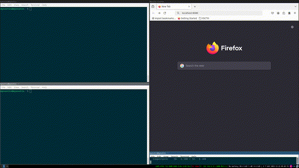

# Overview
`netbird_connection_watcher` is an application that monitors connection status of a netbird client daemon service running on a `mips`- based embedded Linux devices and sends it to host PC so it can be observed in a browser on a local host:



## Prerequisites
- OpenWRT device with a network connection with the host machine
- `build-essential` and `make` - standard development tools
- `mipsel-linux-musl-gcc` - cross-compiler toolchain
    - if not available from the package repository, obtain the source directly, build it locally and add it to PATH:
    ```
    cd
    wget https://musl.cc/mipsel-linux-musl-cross.tgz
    tar xf mipsel-linux-musl-cross.tgz
    export PATH=$PWD/mipsel-linux-musl-cross/bin:$PATH
    ```
- `ssh` installed both on host machine and target device

## Build and run
*For simplicty's sake, the binary you obtain from cross-compiling will be directly copied to the device in `tmp` folder instead of creating an .ipk package that would be integrated into the image.*

From the root of the project directory, simply run `make` which will create the binary inside the build directory. Now copy the binary to the device with:
```
scp -O build/netbird_connection_watcher  root@<target-device-ip>:/tmp/
``` 

Now, ssh into the device and run:
```
ssh -L 8080:127.0.0.1:8080 root@<target-device-ip>
```
to bridge the embedded Linux device and host PC by enabling local port forwarding. This way, the PC acts as some kind of a proxy to the router and visiting `http://localhost:8080` in the PC's browser will expose the output from the target device's app.

Now open another ssh session in a separate terminal and run:
```
cd /var/
./netbird_connection_watcher
```

Finally, on your host PC, open a new tab in the browser and type:
```
http://127.0.0.1:8080/
```
to observe the netbird connection status of the target embedded Linux device.